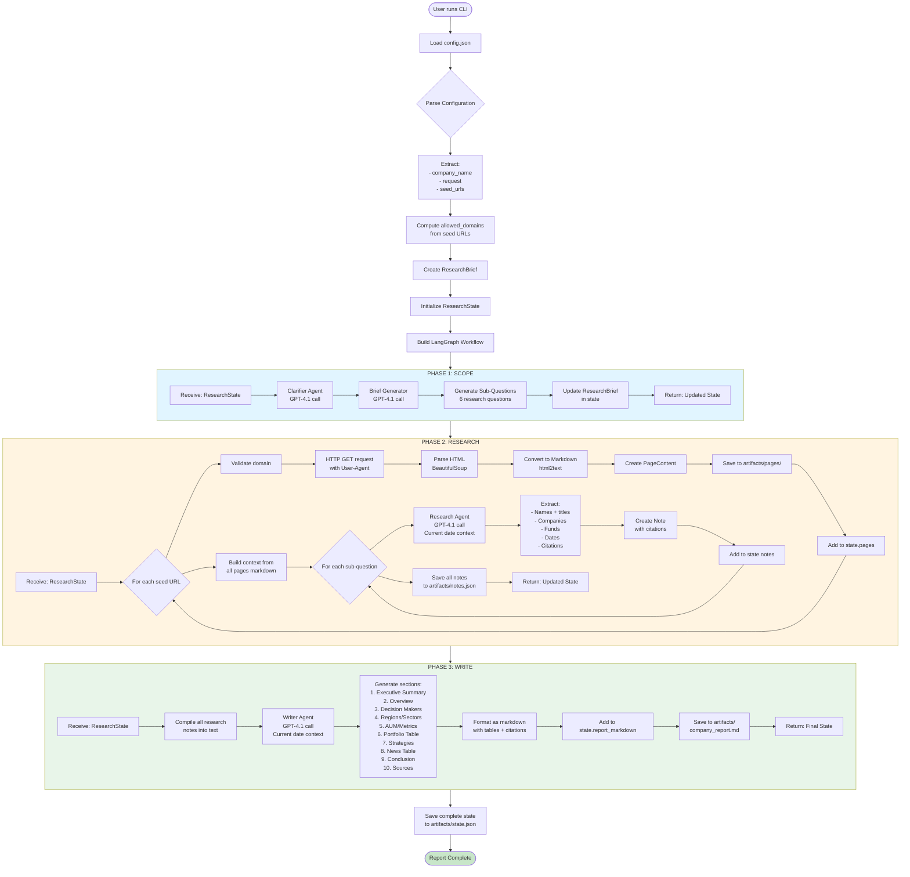
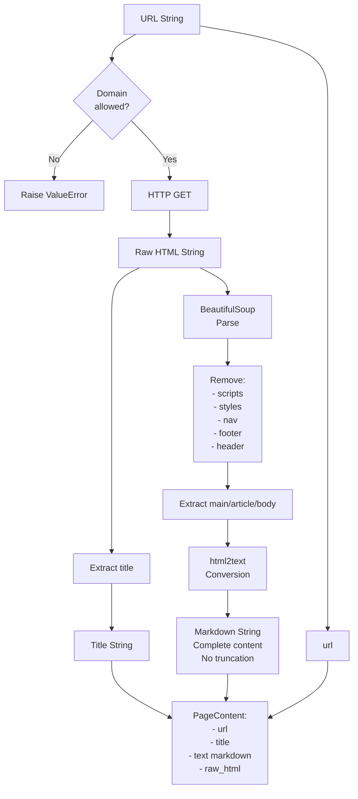
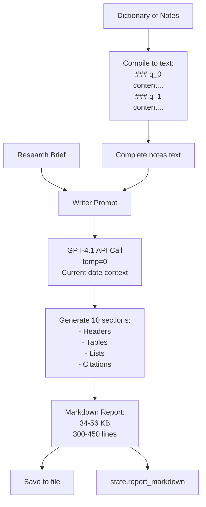
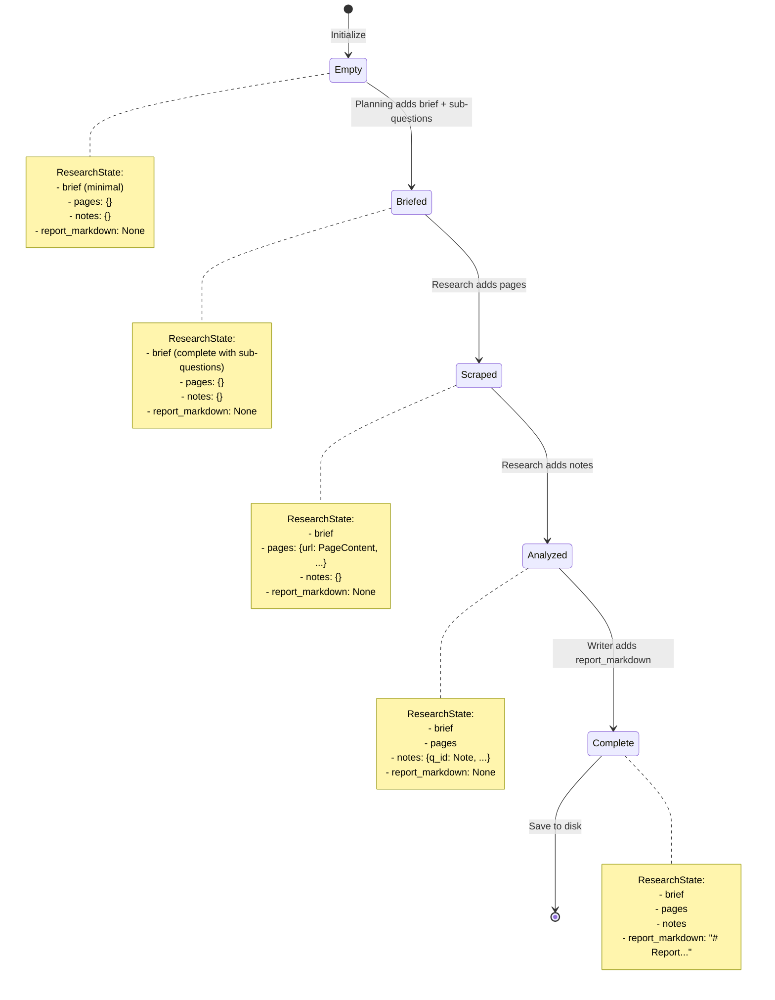
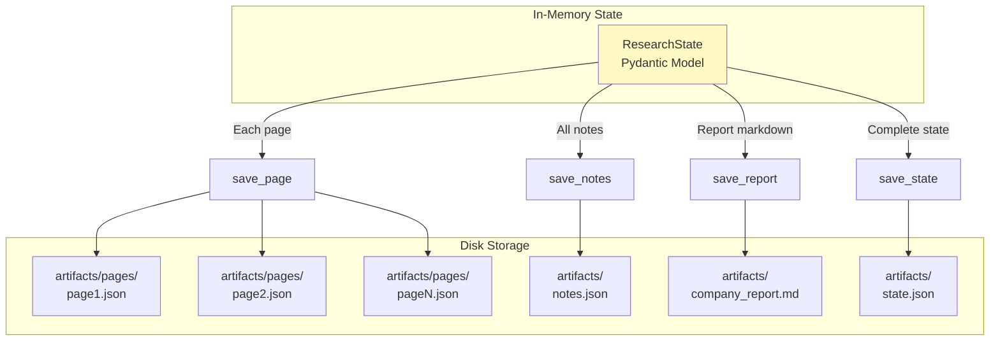
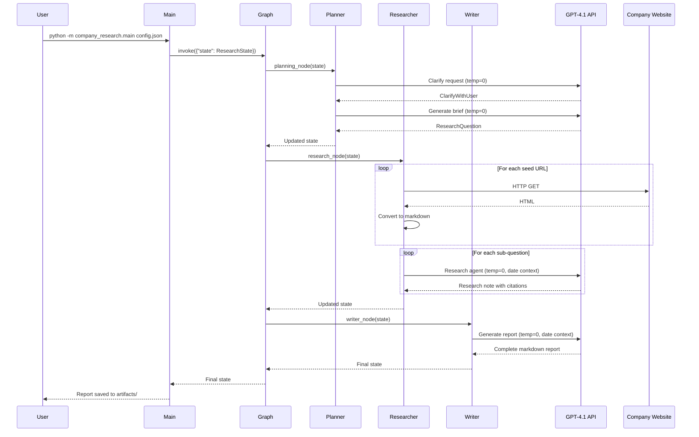
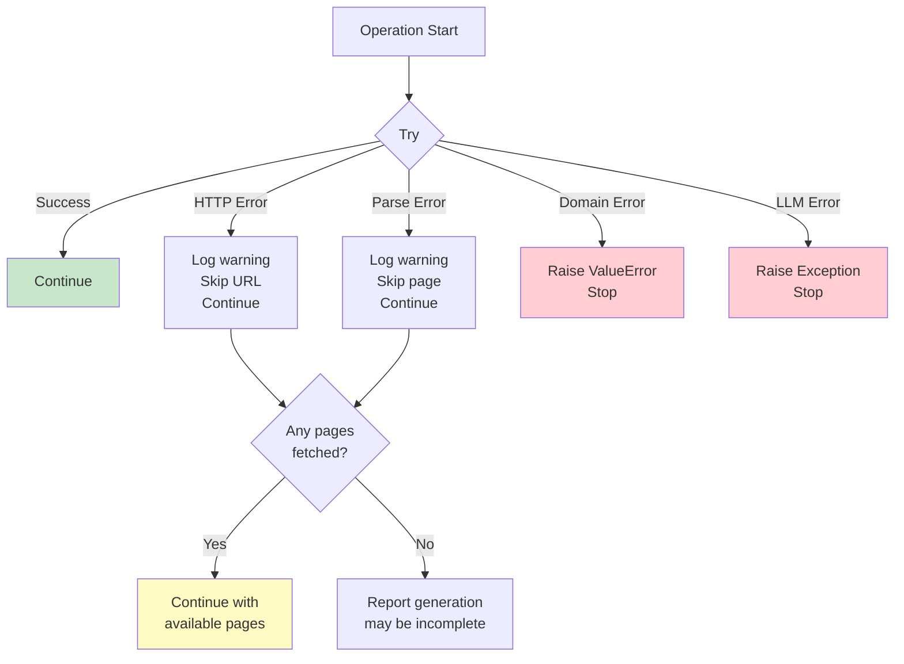
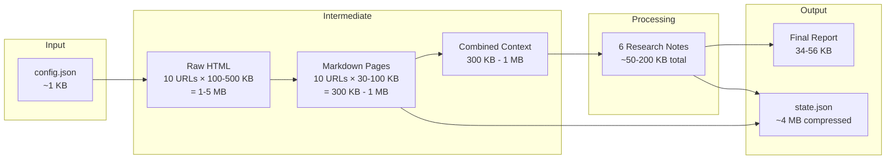

# Data Flow Diagram

## Overview

This document illustrates how data flows through the Company Private Investing Research Agent system, from configuration input to final report generation.

## Complete System Data Flow



## Detailed Data Transformations

### 1. Configuration → ResearchBrief

```mermaid
flowchart LR
    subgraph Input
        CName[company_name:<br/>"Wellington Management"]
        CReq[request:<br/>"Create report on..."]
        CUrls[seed_urls:<br/>Array of URLs]
    end

    subgraph Processing
        Parse[Parse URLs]
        Extract[Extract domains]
        Create[Create constraints]
    end

    subgraph Output
        RB[ResearchBrief:<br/>- company_name<br/>- main_question<br/>- sub_questions: []<br/>- seed_urls<br/>- allowed_domains<br/>- constraints]
    end

    CName --> RB
    CReq --> RB
    CUrls --> Parse
    Parse --> Extract
    Extract --> Create
    Create --> RB
```

### 2. URL → PageContent



### 3. Pages → Research Notes

```mermaid
flowchart TD
    Pages[List of PageContent] --> BuildCtx[Build Context String]
    BuildCtx --> Format[Format as:<br/>SOURCE [1]<br/>URL: ...<br/>Title: ...<br/>markdown text]

    Format --> Context[Complete Context<br/>All pages concatenated]
    SubQ[Sub-Question] --> Prompt[Research Prompt]
    Context --> Prompt

    Prompt --> LLM[GPT-4.1 API Call<br/>temp=0]
    LLM --> Response[LLM Response:<br/>- Analysis<br/>- Citations [1][2]<br/>- URL list]

    Response --> Parse[Parse response]
    Parse --> Note[Note:<br/>- question_id<br/>- content with citations<br/>- sources list]

    Note --> StateNotes[state.notes dict<br/>key: question_id<br/>value: Note]
```

### 4. Notes → Final Report



## State Transitions



## Data Persistence Flow



## API Call Flow



## Error Handling Flow



## Data Size Evolution



## Citation Tracking Flow

```mermaid
flowchart TD
    Source[Source Page URL] --> Extract[Extract info with citation]
    Extract --> Inline[Add inline citation [1]]
    Inline --> NoteContent[Note content:<br/>"Company has $385M fund [1]"]

    Source --> SourceList[Note sources list:<br/>[url1, url2, ...]]

    NoteContent --> Compile[Compile all notes]
    SourceList --> Compile

    Compile --> Writer[Writer receives notes]
    Writer --> Map[Map citations to URLs]
    Map --> ReportCite[Report inline: [1]]
    Map --> ReportSources[Report Sources section:<br/>[1] url<br/>[2] url]

    ReportCite --> FinalReport[Final Report]
    ReportSources --> FinalReport
```

## Key Data Characteristics

### Data Formats
- **Input**: JSON (config)
- **Intermediate**: Pydantic models (in-memory), HTML, Markdown
- **Output**: Markdown (report), JSON (state, pages, notes)

### Data Volume
- **Configuration**: ~1 KB
- **Scraped HTML**: 1-5 MB total
- **Markdown content**: 300 KB - 1 MB
- **Research notes**: 50-200 KB
- **Final report**: 34-56 KB
- **Complete state**: ~4 MB

### Data Retention
- **Artifacts persisted**: All scraped pages, notes, report, state
- **In-memory only**: LLM responses during processing
- **Reusable**: State can be reloaded for analysis
