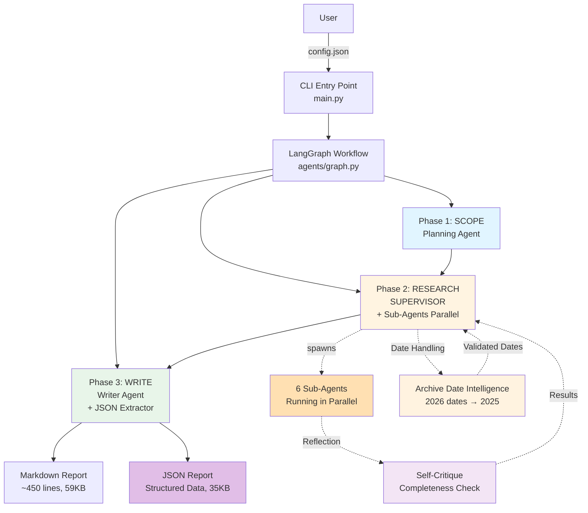
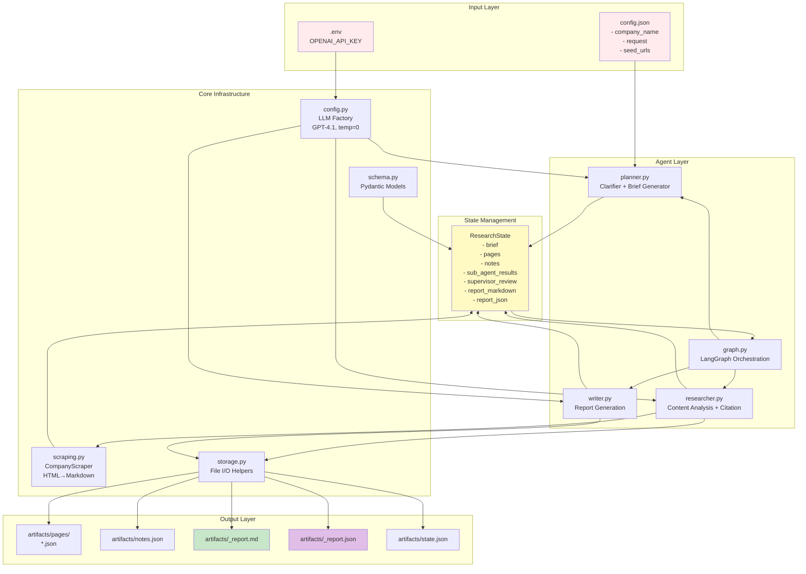
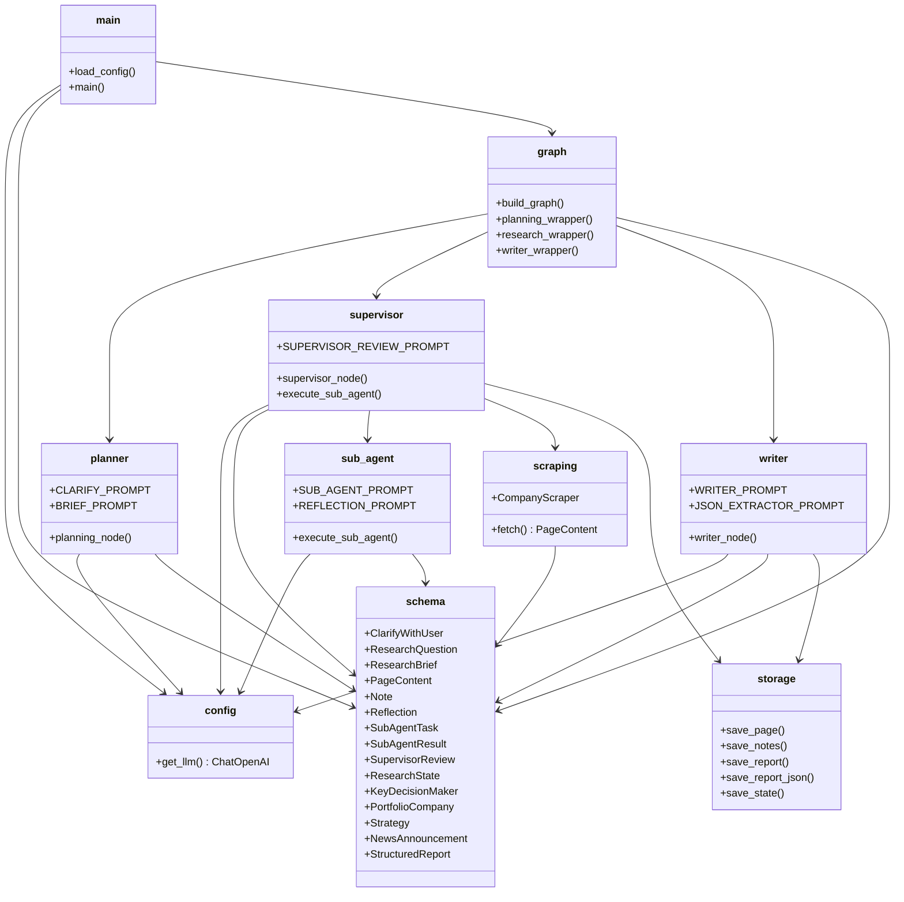

# System Architecture Diagram - V2.5

## Overview

The Company Private Investing Research Agent is built on a **3-phase LangGraph architecture with Supervisor + Sub-Agents** that orchestrates multiple specialized agents with reflection capabilities to produce comprehensive, high-quality research reports in both Markdown and JSON formats.

**Version History:**
- **V1.0**: Single research agent (linear)
- **V2.0**: Supervisor + Sub-Agents with reflection (parallel)
- **V2.1**: Enhanced date extraction precision
- **V2.2**: Date validation (reject future dates)
- **V2.3**: Comprehensive news extraction (ALL items)
- **V2.4**: Structured JSON report output
- **V2.5**: Intelligent date handling (archive expiry dates)

## High-Level Architecture (V2.5)

## Detailed Component Architecture

## Technology Stack

## Module Relationships

## Deployment View

## Key Design Patterns

1. **State Management**: Centralized `ResearchState` passed through workflow
2. **Strategy Pattern**: Different agents for different phases
3. **Factory Pattern**: `get_llm()` for LLM instantiation
4. **Data Models**: Pydantic for validation and serialization
5. **Chain of Responsibility**: LangGraph linear workflow
6. **Repository Pattern**: Storage layer abstracts file I/O

## Scalability Considerations

- **Modular agents**: Easy to add new research types
- **Configurable URLs**: Works for any company
- **LLM abstraction**: Easy to swap models
- **Storage abstraction**: Can switch to databases
- **Graph workflow**: Can add parallel processing

## Security Features

- **Domain validation**: Only scrapes allowed domains
- **Environment variables**: API keys in `.env`
- **No external knowledge**: Scoped to provided URLs
- **Citation tracking**: Transparency in data sources
