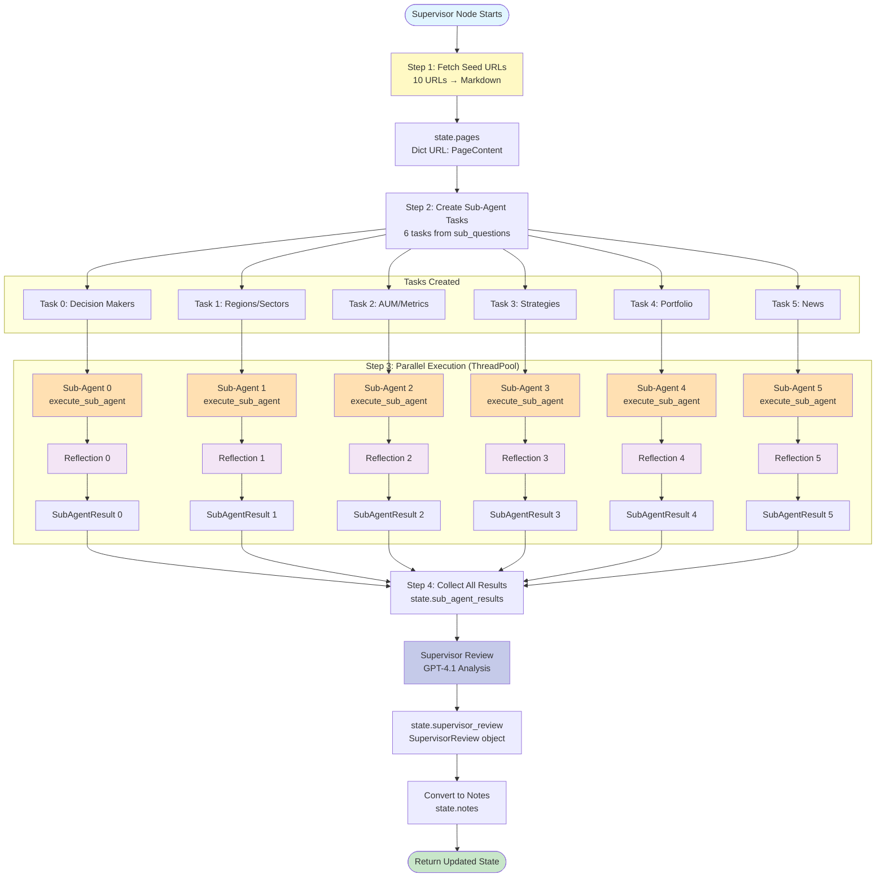
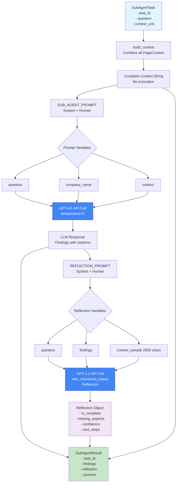
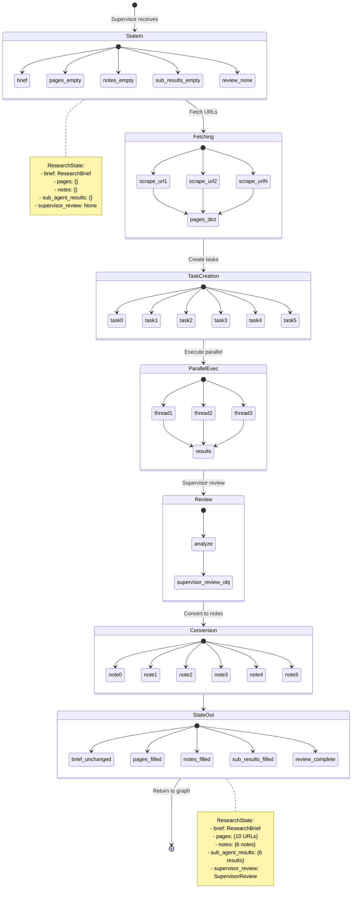
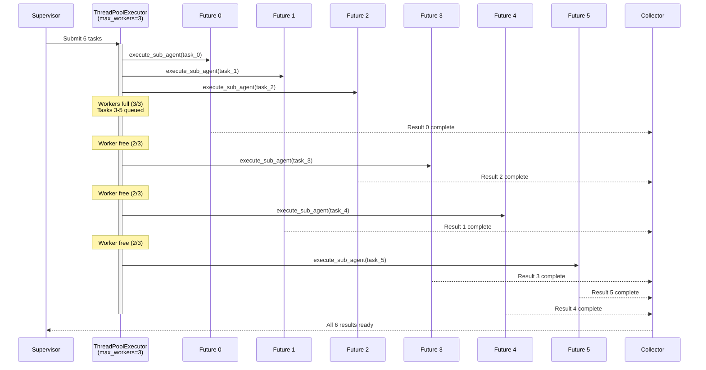
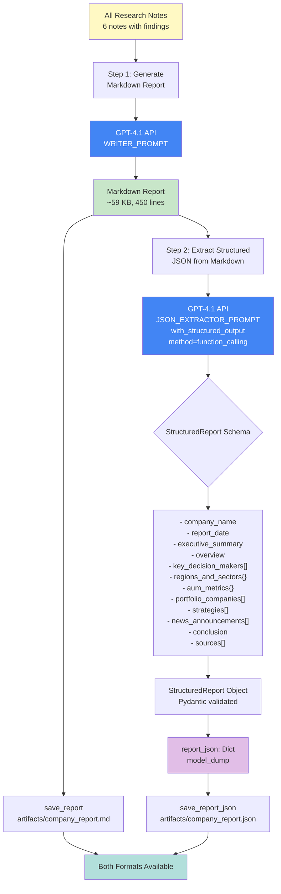
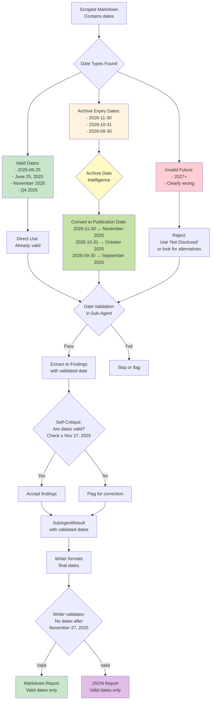
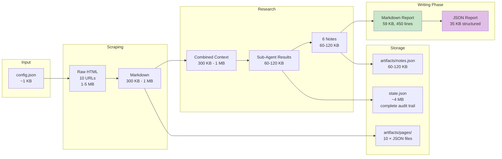

# V2.5 Data Flow with Supervisor + Sub-Agents + JSON Output

## Complete V2.0 Research Phase Data Flow



## Sub-Agent Internal Data Flow



## State Evolution Through V2.0 Research Phase



## Parallel Execution Timeline

```mermaid
gantt
    title V2.0 Sub-Agent Parallel Execution
    dateFormat ss
    axisFormat %S

    section Supervisor
    Fetch URLs           :00, 10s
    Create Tasks         :10, 2s
    Review Results       :50, 5s
    Convert to Notes     :55, 2s

    section Thread 1
    Sub-Agent 0 Research :12, 15s
    Sub-Agent 0 Reflect  :27, 5s
    Sub-Agent 3 Research :32, 10s
    Sub-Agent 3 Reflect  :42, 3s

    section Thread 2
    Sub-Agent 1 Research :12, 18s
    Sub-Agent 1 Reflect  :30, 4s
    Sub-Agent 4 Research :34, 12s
    Sub-Agent 4 Reflect  :46, 4s

    section Thread 3
    Sub-Agent 2 Research :12, 12s
    Sub-Agent 2 Reflect  :24, 3s
    Sub-Agent 5 Research :27, 14s
    Sub-Agent 5 Reflect  :41, 5s
```



## Data Size Evolution in V2.0

```mermaid
graph LR
    subgraph "Input (Config)"
        Config[config.json<br/>~1 KB]
    end

    subgraph "Scraping"
        HTML[Raw HTML<br/>10 URLs<br/>1-5 MB total]
        MD[Markdown<br/>10 URLs<br/>300 KB - 1 MB]
    end

    subgraph "Context Building"
        Context[Combined Context<br/>All 10 pages<br/>300 KB - 1 MB<br/>NO TRUNCATION]
    end

    subgraph "Sub-Agent Results"
        SA1R[Result 1: 10-20 KB]
        SA2R[Result 2: 10-20 KB]
        SA3R[Result 3: 10-20 KB]
        SA4R[Result 4: 10-20 KB]
        SA5R[Result 5: 10-20 KB]
        SA6R[Result 6: 10-20 KB]
        Total[Total: 60-120 KB]
    end

    subgraph "Reflections"
        Ref[6 Reflections<br/>~1 KB each<br/>~6 KB total]
    end

    subgraph "Supervisor Review"
        Review[SupervisorReview<br/>~2 KB]
    end

    subgraph "Notes"
        Notes[6 Notes<br/>60-120 KB]
    end

    subgraph "Final Report"
        Report[Markdown Report<br/>49 KB<br/>447 lines]
    end

    subgraph "State File"
        State[state.json<br/>~4 MB<br/>includes all data]
    end

    Config --> HTML
    HTML --> MD
    MD --> Context
    Context --> SA1R
    Context --> SA2R
    Context --> SA3R
    Context --> SA4R
    Context --> SA5R
    Context --> SA6R
    SA1R --> Total
    SA2R --> Total
    SA3R --> Total
    SA4R --> Total
    SA5R --> Total
    SA6R --> Total
    Total --> Ref
    Total --> Review
    Ref --> Review
    Review --> Notes
    Notes --> Report
    MD --> State
    Total --> State
    Ref --> State
    Review --> State
    Notes --> State
```

## ThreadPoolExecutor Flow



## V2.1 Date Extraction Enhancement Flow

```mermaid
flowchart TD
    Source[Source Markdown<br/>Contains dates in multiple formats]

    Search[Sub-Agent searches for:]
    ISO["ISO: 2025-06-25"]
    Written["Written: June 25, 2025"]
    MonthYear["Month+Year: June 2025"]
    Quarter["Quarter: Q4 2025"]
    Year["Year: 2025"]

    Source --> Search
    Search --> ISO
    Search --> Written
    Search --> MonthYear
    Search --> Quarter
    Search --> Year

    Prioritize{Prioritization Rule:<br/>Use MOST PRECISE}

    ISO --> Prioritize
    Written --> Prioritize
    MonthYear --> Prioritize
    Quarter --> Prioritize
    Year --> Prioritize

    Prioritize -->|ISO or Written found| Precise[Use "June 25, 2025"]
    Prioritize -->|Only Month+Year| Medium[Use "June 2025"]
    Prioritize -->|Only Quarter| Vague[Use "Q4 2025"]
    Prioritize -->|Only Year| Last[Use "2025"]

    Precise --> Reflection
    Medium --> Reflection
    Vague --> Reflection
    Last --> Reflection

    Reflection{Self-Critique:<br/>Are dates precise?}

    Reflection -->|Yes| Accept[Accept findings]
    Reflection -->|No| Flag[Flag in reflection:<br/>missing_aspects]

    Accept --> Output[SubAgentResult<br/>with precise dates]
    Flag --> Output

    Output --> Supervisor[Supervisor Review<br/>checks date precision]

    style Source fill:#fff9c4
    style Precise fill:#c8e6c9
    style Medium fill:#fff9c4
    style Vague fill:#ffecb3
    style Last fill:#ffcdd2
    style Reflection fill:#f3e5f5
```

## Citation Tracking in V2.0

```mermaid
flowchart TD
    Pages[10 PageContent objects<br/>with URLs]

    SubAgent[Sub-Agent processes<br/>complete context]

    Extract[Extract facts with<br/>inline citations]

    Inline["Findings text:<br/>'Company has $385M fund [1]<br/>Announced June 25, 2025 [1]<br/>Led by Greg Wasserman [2]'"]

    Sources[Sources list:<br/>[url1, url2, ...]]

    Result[SubAgentResult<br/>- findings<br/>- sources]

    Notes[Convert to Note<br/>- content<br/>- sources]

    Writer[Writer receives<br/>all notes]

    Map[Map citations<br/>across all notes]

    Report["Final Report:<br/>[1] url1<br/>[2] url2<br/>...<br/>[10] url10"]

    Pages --> SubAgent
    SubAgent --> Extract
    Extract --> Inline
    Extract --> Sources
    Inline --> Result
    Sources --> Result
    Result --> Notes
    Notes --> Writer
    Writer --> Map
    Map --> Report

    style Pages fill:#e1f5ff
    style Inline fill:#fff9c4
    style Report fill:#c8e6c9
```

## Summary: V2.5 Data Flow Advantages

| Aspect | V1.0 | V2.0-V2.5 | Benefit |
|--------|------|------|---------|
| **Context per LLM call** | Full context × 6 (sequential) | Full context × 6 (parallel) | Faster |
| **Specialization** | Generic research | Focused per question | Deeper |
| **Self-Critique** | None | 6 reflections | Quality |
| **Coordination** | None | Supervisor review | Gaps found |
| **Result tracking** | Simple notes | SubAgentResult + Reflection | Transparency |
| **State richness** | Basic | Full audit trail | Debuggable |
| **Citation precision** | Per note | Per note + per agent | Maintained |
| **Date precision** | Good | Enhanced (V2.1) | Better |
| **Date validation** | None | Archive date intelligence (V2.5) | Accurate |
| **Output formats** | Markdown only | Markdown + JSON (V2.4) | Flexible |
| **News extraction** | Basic | Comprehensive ALL items (V2.3) | Complete |

## V2.4 JSON Output Generation Flow



## V2.5 Intelligent Date Handling Flow



## Enhanced Data Size Evolution (V2.4+)



## Key Data Transformations (Updated for V2.5)

1. **URL → PageContent**: HTML → Markdown (html2text)
2. **PageContent → Context**: Concatenate all pages (no truncation)
3. **Context + Question → Findings**: GPT-4.1 research (with date validation)
4. **Findings → Reflection**: GPT-4.1 self-critique (checks dates)
5. **Findings + Reflection → SubAgentResult**: Structured result
6. **All SubAgentResults → SupervisorReview**: Gap analysis
7. **SubAgentResults → Notes**: Writer-ready format
8. **Notes → Markdown Report**: Final markdown with citations (validated dates)
9. **Markdown Report → JSON Report**: Structured extraction (GPT-4.1)
