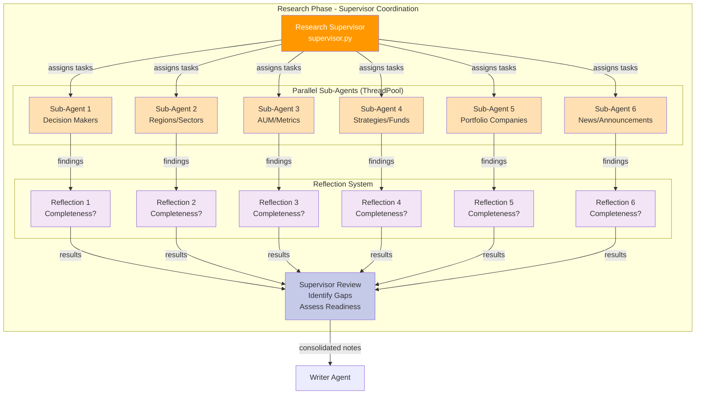
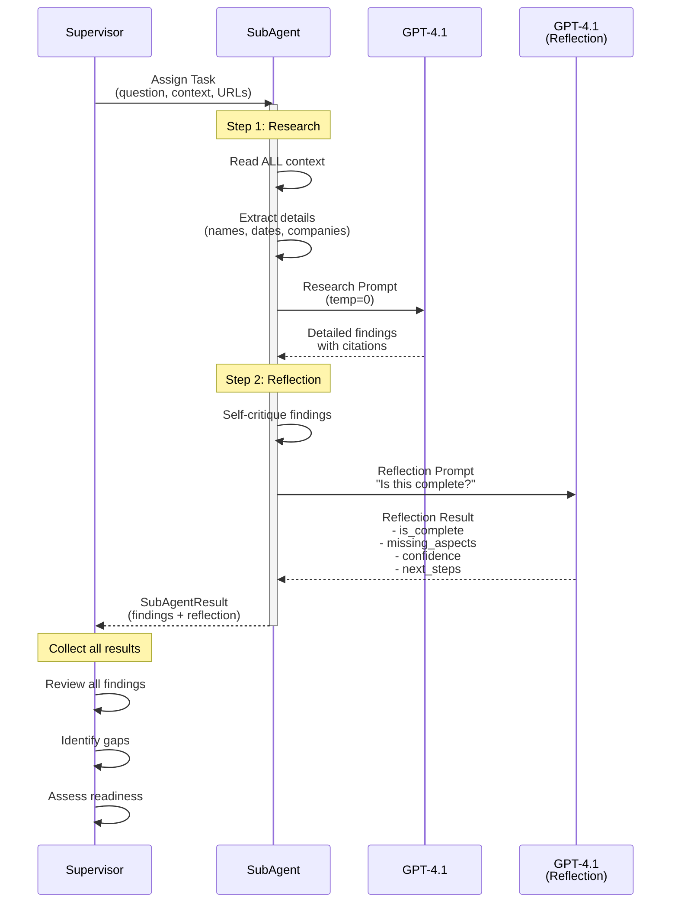
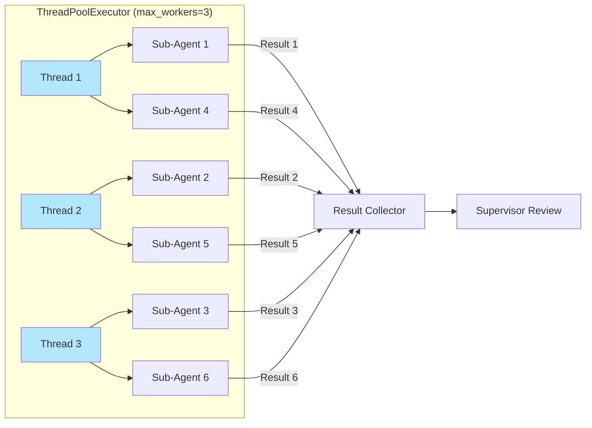
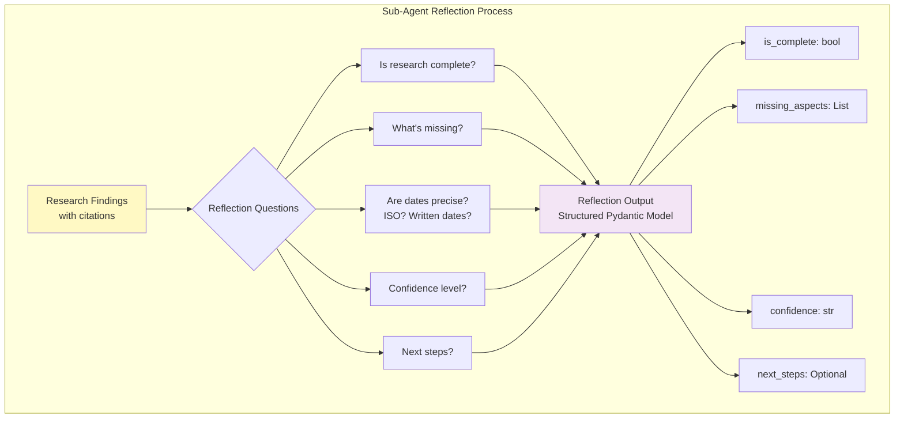
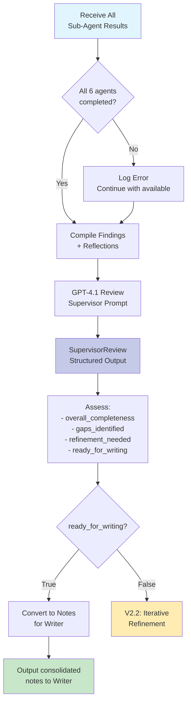
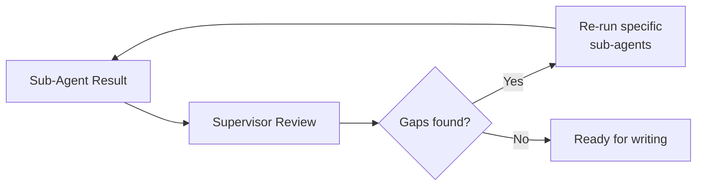
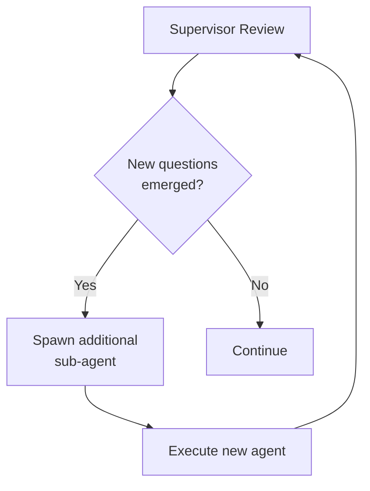

# V2.0 Supervisor + Sub-Agent Architecture

## V2.0 Innovation: Multi-Agent Coordination

V2.0 introduces a **supervisor architecture** inspired by LangChain's `deep_research_from_scratch`, where a supervisor coordinates multiple specialized sub-agents that work in parallel with self-reflection capabilities.

## Supervisor Architecture Overview



## Sub-Agent Execution Flow



## Parallel Execution Architecture



## Reflection System (Thinking Tool)



## Supervisor Review Logic



## Key V2.0 Features

### 1. Specialization
Each sub-agent focuses on **ONE research question**, enabling deeper analysis:
- Sub-Agent 1: Decision Makers (70+ people extracted)
- Sub-Agent 2: Regions & Sectors
- Sub-Agent 3: AUM & Metrics
- Sub-Agent 4: Strategies & Funds
- Sub-Agent 5: Portfolio Companies (240+ companies)
- Sub-Agent 6: News & Announcements (20+ items with precise dates)

### 2. Reflection (Thinking Tool)
Each sub-agent self-critiques before returning results:
```python
class Reflection(BaseModel):
    is_complete: bool  # "Did I get everything?"
    missing_aspects: List[str]  # "What did I miss?"
    confidence: str  # "high", "medium", or "low"
    next_steps: Optional[str]  # "What should I do next?"
```

### 3. Parallel Execution
- ThreadPoolExecutor with 3 workers
- 6 sub-agents run concurrently
- Faster execution compared to V1.0 sequential processing
- Results collected as they complete (`as_completed`)

### 4. Supervisor Coordination
- Reviews all findings and reflections
- Identifies gaps across all research
- Assesses overall completeness
- Prepares for iterative refinement (V2.2+)

## Data Models (schema.py)

### Sub-Agent Task
```python
class SubAgentTask(BaseModel):
    task_id: str  # "q_0", "q_1", etc.
    question: str  # Specific research question
    context_urls: List[HttpUrl]  # URLs to focus on
```

### Sub-Agent Result
```python
class SubAgentResult(BaseModel):
    task_id: str
    findings: str  # Detailed findings with citations
    reflection: Reflection  # Self-critique
    sources: List[HttpUrl]  # URLs used
```

### Supervisor Review
```python
class SupervisorReview(BaseModel):
    overall_completeness: str  # Assessment
    gaps_identified: List[str]  # What's missing
    refinement_needed: bool  # Need another iteration?
    ready_for_writing: bool  # Ready for report?
```

## Performance Comparison

| Metric | V1.0 (Single Agent) | V2.0 (Supervisor) | Improvement |
|--------|---------------------|-------------------|-------------|
| Architecture | Linear | Parallel | ✅ |
| Agents | 1 | 6 specialized | **6x specialization** |
| Self-Critique | None | Reflection per agent | ✅ Added |
| Coordination | None | Supervisor review | ✅ Added |
| Execution | Sequential | Concurrent (3 workers) | **Faster** |
| Report Lines | 298 | 447-521 | **+51-75%** |
| Decision Makers | 48 | 70+ | **+46%** |
| Portfolio Companies | 240 | 240+ | Maintained |
| Gaps Identified | None | 9-11 per run | **Quality check** |
| Confidence Tracking | None | Per agent | **Transparency** |

## Future Enhancements (V2.2+)

### Iterative Refinement


### Dynamic Sub-Agent Spawning


### Confidence-Based Prioritization
- Focus refinement on low-confidence findings
- Skip re-running high-confidence agents
- Optimize iteration cycles

## Code Structure

```
company_research/agents/
  ├── supervisor.py          # NEW V2.0: Coordinates sub-agents
  ├── sub_agent.py           # NEW V2.0: Specialized research + reflection
  ├── planner.py             # Scope phase (unchanged)
  ├── writer.py              # Write phase (enhanced for V2.1 dates)
  └── graph.py               # Updated to use supervisor
```

## Configuration

```python
# ThreadPool configuration (supervisor.py)
ThreadPoolExecutor(max_workers=3)

# LLM configuration (config.py)
model="gpt-4.1"
temperature=0  # V2.1: Maximum factual consistency
```

## Monitoring & Logging

Sub-agent execution provides real-time feedback:
```
[3/4] Executing 6 sub-agents in parallel...
  → Sub-agent working on: q_0
  → Sub-agent working on: q_1
  → Sub-agent reflecting on: q_0
  ✓ Sub-agent completed: q_0 (confidence: medium)
  ...
  ✓ Completed 6/6 sub-agents
```

Supervisor review summary:
```
[4/4] Supervisor reviewing findings...
  Completeness: The research provides a solid foundation...
  Ready for writing: True
  Gaps identified: 11
```

## Summary

V2.0's supervisor architecture delivers:
- ✅ **Better Quality**: Specialized agents + reflection
- ✅ **Better Speed**: Parallel execution
- ✅ **Better Completeness**: Supervisor identifies gaps
- ✅ **Better Transparency**: Confidence tracking per finding
- ✅ **Better Scalability**: Easy to add more sub-agents or refinement loops
